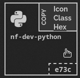

## how to use
install the [New Tab Override](https://addons.mozilla.org/en-US/firefox/addon/new-tab-override/) extension for firefox, click on it's icon at the top right, in the option section use local file and upload the html file, open a new tab and close everything else, in firefox settings, choose the `home` button at the left section and in the `homepage and new window` area choose `custom page` and click on `use current pages`

## how to show glyphs?
go to the nerd fonts [website](https://www.nerdfonts.com/) and download the [CaskaydiaCove Nerd Font](https://github.com/ryanoasis/nerd-fonts/releases/download/v2.1.0/CascadiaCode.zip) font and install the windows compatible version (even if you are on linux or mac), open the font manager in your os and find the name it was installed as exactly and write it in the html file if it's different from what is listed and upload the html file again in the extension

## how it looks?

https://user-images.githubusercontent.com/59083599/155002545-221b496f-c48d-4efd-b473-aa435981f295.mp4

## customizing for your needs
adding and removing links is easy, just copy paste an existing line and change it's content or just remove any that you don't want, check the nerd fonts [cheat cheat](https://www.nerdfonts.com/cheat-sheet) for other glyphs and copy the hex value to make a new class in the style section for extra glyphs, here is an example:



```
.python:before { content: "\e73c"; }
```

now make a new link for the homepage of the python website

```
<a href="https://www.python.org/"> <i class="nf python"></i>&nbsp; Python</a>
```
